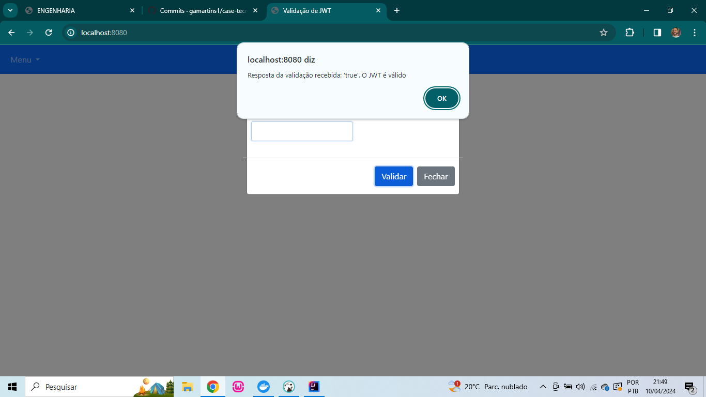

## Repositório para desenvolvimento da solução do case técnico de backend

Este repositório tem como objetivo armazenar o processo de desenvolvimento da solução proposta ao desafio dos cases arquitetural e técnico com foco em backend.  
O desafio consiste em duas partes, sendo:

### Case arquitetural:
Foram desenvolvidos um fluxograma e um desenho técnico para exemplificação do cenário proposto de abertura de uma conta em banco.
- **Fluxograma**: Foi desenvolvido com base em um fluxo onde a abertura de conta é solicitada por um meio digital (aplicativo), porém durante a validação dos documentos por parte do banco são encontradas algumas inconsistências, logo se faz necessário solicitar a retificação ao cliente, que tem a possibiliadde de fazê-la novamente por meio digital ou através da ida na agência. Após a retificação necessária e continuação da análise, é determinado se a conta pôde ser aberta, onde em um cenário negativo o cliente é informado pelo banco; e caso o contrário é solicitada a sua ida até uma agência para realizar procedimentos de segurança e ter a conta finalmente aberta e disponível para uso.

O arquivo do fluxograma pode ser visualizado através da plataforma [Draw.io](https://app.diagrams.net/).

[Arquivo do fluxograma](Fluxograma%20desafio%20arquitetural%20Abertura%20de%20conta.drawio)

- **Desenho técnico**: O desenho de arquitetura da solução visa mapear as técnologias/ferramentas que serão utilizadas no ciclo de uso da aplicação.  
Para o cenário proposto, a arquitetura foi pensada com base nos serviços AWS, onde como ponto de partida é exposta uma API responsável por captar as requests dos clients, e logo em seguida realizar um balanceamento de carga conforme as chamadas recebidas, a fim de não sobrecarregar o serviço principal.  
O serviço contido em um ECS realiza a validação dos dados e documentos recebidos na request, e após sua análise faz a persistência em um banco de dados e em seguida dispara uma notificação ao cliente usando um tópico SNS para informar ao cliente se há a necessidade de uma retificação ou informa a aceitação/recusa de abertura da conta, conforme o fluxograma.

O arquivo do desenho técnico pode ser visualizado através da plataforma [Draw.io](https://app.diagrams.net/).

[Arquivo do desenho técnico da solução](Desenho%20técnico%20da%20solução.drawio)

### Case técnico:

O case técnico consiste no desenvolvimento de uma API que realize a validação em um texto na estrutura JWT.  
Ao receber o JWT, a API valida as seguintes regras:
- Deve ser um JWT válido;
- Deve conter apenas 3 claims(Name, Role e Seed);
- A claim Name não pode ter carácter de números;
- A claim Role deve conter apenas 1 dos três valores (Admin, Member e External);
- A claim Seed deve ser um número primo;
- O tamanho máximo da claim Name é de 256 caracteres.

Com todas as condicionais acima satisfeitas, é determinado que o JWT recebido é válido, caso contrário determina-se o JWT como inválido.

#### Aplicação desenvolvida
Este projeto foi desenvolvido utilizando a linguagem Java com Spring, com gerenciamento das dependências em Maven.
 
Foi criada uma API REST para recebimento e processamento do JWT.  
A API fica disponível na seguinte URL: [http://<SUA_URL>/api/v1/validarJwt]()

Ao receber a request, a API aplica as regras determinadas para validação do JWT, onde após a validação é devolvido como response um valor booleano, sendo **true** para o JWT válido e **false** para inválido.

A API trata da persistência dos JWTs recebidos, criando um registro em banco com alguns parâmetros da request, como o prórpio JWT, data/hora do recebimento da chamada, etc.  
Foi utilizado um banco PostgreSQL para persistência, sendo manipulado por Hibernate como framework de JPA.  
O banco de dados é exclusivo da aplicação e conteinerzado com Docker.

A validação do JWT é feita em três camadas, onde:
- **Validação técnica estrutural**: Valida que o texto codificado recebido atende a estrutura de um JWT (pontos delimitadores, decodificação, header/payload/signature, etc).  
Essa validação foi delegada ao framework Spring Security, no módulo Oauth2, preparado para lidar com JWTs;
- **Validação híbrida (técnica/négocio)**: sendo o JWT válido, é validado que o Payload é um JSON também válido, e que esse JSON atende a estrutura conhecida pela aplicação.  
Essa validação foi delegada ao framework Jackson, que é utilizado para a serialização/desserialização de JSONs, logo permite sabermos se as Claims do Payload estruturam o JSON esperado.
- **Validação de negócio**: Com o JSON válido, são aplicadas as regras de negócio (mencionadas anteriormente).  
Ainda com o Jackson, em seu processo de desserialização ele popula todos os atributos do objeto que representará o JSON, e ele faz isso através dos setters. Sabendo disso, as regras de negócio são aplicadas pelo próprio Jackson ao acessar os setters, onde neles foram aplicadas as validações, e em caso de qualquer violação ocorre uma exceção representativa da regra violada.

A API é consultada por uma tela na aplicação, onde o JWT pode ser validado:

Todas as validações de JWT (tanto por chamada externa quanto por tela) ficam registradas e podem ser consultadas em uma tela da aplicação:

As telas foram desenvolvidas utilizando HTML com Thymeleaf, JavaScript.

#### Informações de uso da aplicação
- É necessário possuir o Docker instalado, pois a aplicação executará o [script Docker](docker-compose.yml) para criação de um container para disponibilização do banco de dados;
- A API pode ser testada também via Postman: [Link dos projetos com a coleção de requests](__docs__/API/Validação%20de%20JWT.json);